<!-- Logo -->

  

# 🏥 Medico - Bridging Healthcare Gaps Digitally

> One-stop solution for online doctor consultations, ambulance booking, and digital health management.

> Designed to make healthcare accessible, efficient, and secure for everyone, everywhere.

---

## 🔍 About the Project

**Medico** is a comprehensive healthcare platform that enables users to:
- Instantly book doctor appointments and join consultations directly via Zoom.
- Locate and book ambulances in real-time with Google Maps integration.
- Search for nearby hospitals and clinics.
- Securely store, manage, and access prescriptions and medical reports online.

Unlike traditional healthcare portals, Medico brings together telemedicine, emergency response, and health record management into a single, user-friendly platform.

---

## 👨🏻‍💻 Tech Stack Used

| 🔧 Layer             | ⚙️ Technologies Used |
|----------------------|-------------------------|
| 🎨 **Frontend**       | React.js, Tailwind CSS |
| 🐍 **Backend**        | Node, express.js |
| 🗄️ **Database**        | MongoDB |
| 🗺️ **Maps & Location** | Google Maps API |
| 📹 **Video Calls**     | Zoom API Integration |
| 🛠️ **Tools & Utilities** | Postman, GitHub, VS Code |

---

## ✨ Features

- 👨‍⚕️ **Doctor Appointment Booking:**  
  Find doctors by specialty and book appointments instantly, with direct Zoom video consultation links.

- 🚑 **Ambulance Booking with Live Route:**  
  Book ambulances in emergencies and track their real-time route using Google Maps.

- 🏥 **Nearby Hospital/Clinic Search:**  
  Locate and view details of nearby healthcare facilities on an interactive map.

- 📄 **Digital Prescription & Report Storage:**  
  Upload, store, and access medical prescriptions and reports securely from any device.

- 🔒 **User Authentication & Profile Management:**  
  Secure login, profile updates, and health record management.

- 📱 **Mobile-Responsive Design:**  
  Accessible and fully functional on both desktop and mobile devices.

---

## 📸 Project Demo

### 1️⃣ Registration (Three Roles)
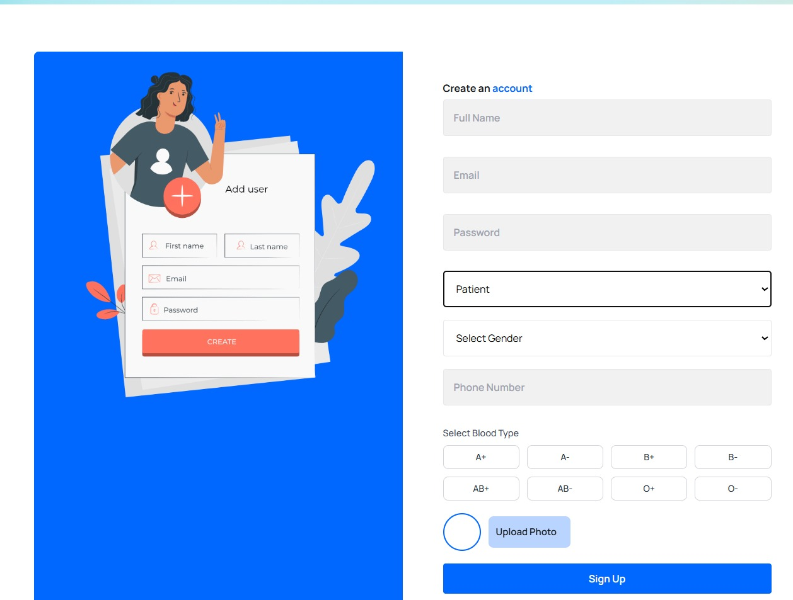
 >Users can register as Doctor, Patient, or Ambulance Driver, selecting their role at signup.

---

### 2️⃣ Home Page & Navigation
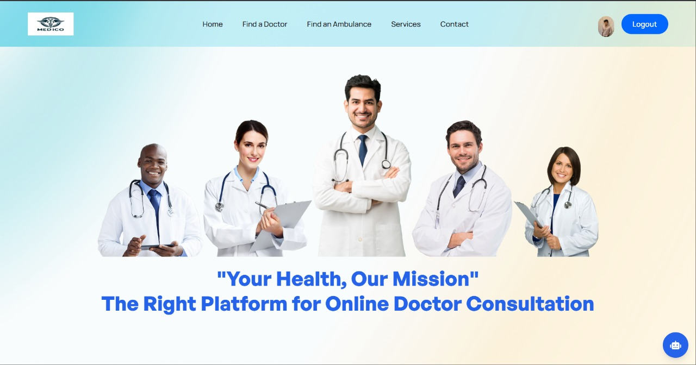
 > The home page features a clear navigation bar for easy access to all platform services.

---

### 3️⃣ Find Doctor
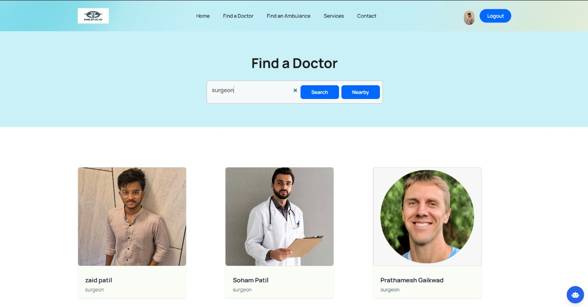
 > Search for doctors by specialization or name, making it easy to find the right healthcare professional.

---

### 4️⃣ Nearby Doctors
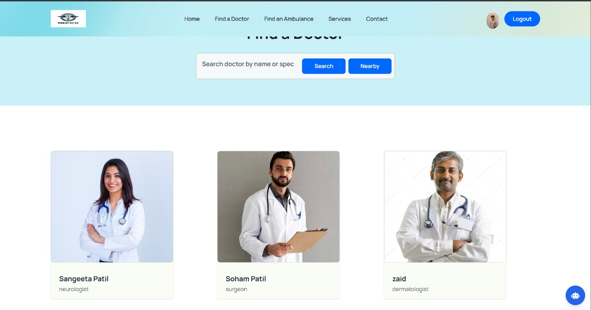
 > View only doctors available nearby, helping users connect with local healthcare providers quickly.

---

### 5️⃣ Booking Doctor Appointment
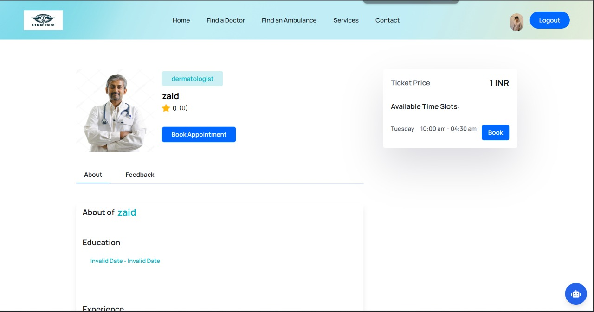
 > Book appointments with doctors based on their available slots. Doctors set their free slots, visible to patients. Payments are handled via Razorpay (test environment), and appointments are scheduled on Zoom.

---

### 6️⃣ Doctor Appointments Overview
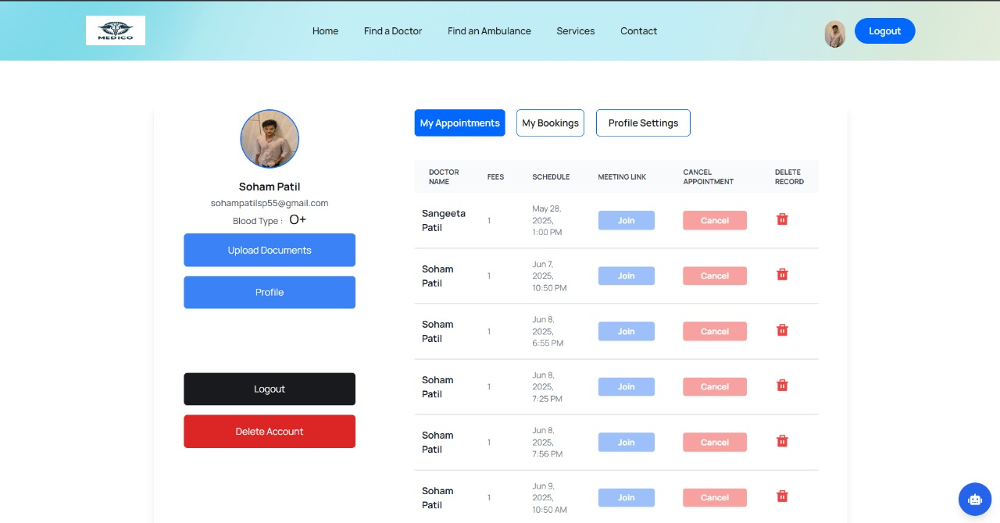
 > Patients can view their booked appointments with doctors, including direct Zoom join links.

---

### 7️⃣ Email Reminder
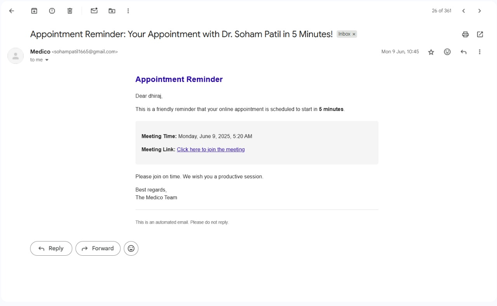
 > Patients receive an email reminder 5 minutes before their scheduled appointment with the doctor.

---

### 8️⃣ Doctor Profile & Meeting Management
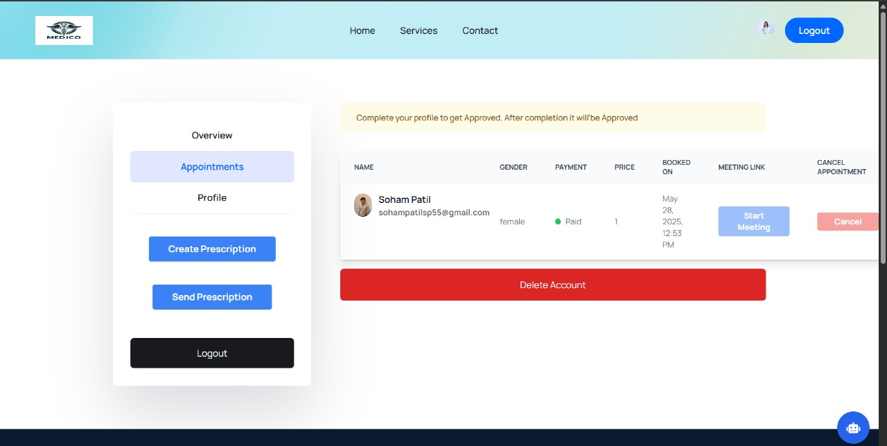
 > Doctors can track all their meetings and join upcoming appointments directly from their profile.

---

### 9️⃣ Find Ambulance
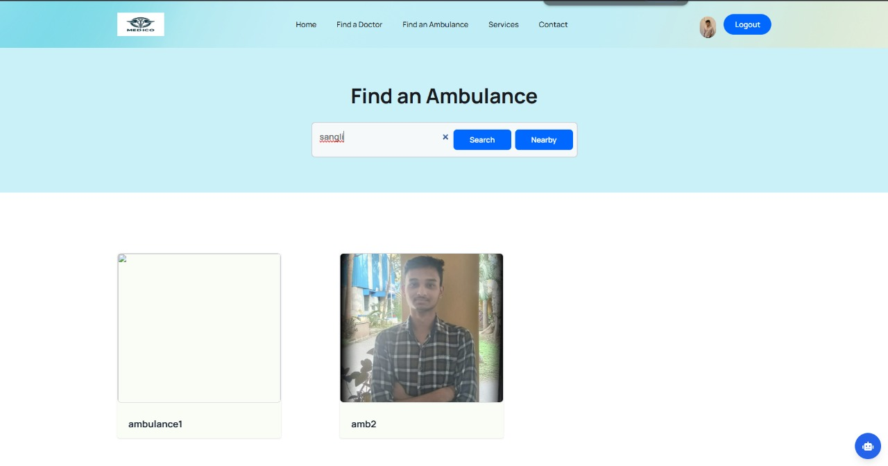
 > Search for ambulances by region or driver name for quick emergency response.

---

### 1️⃣0️⃣ Nearby Ambulances (Google Maps)
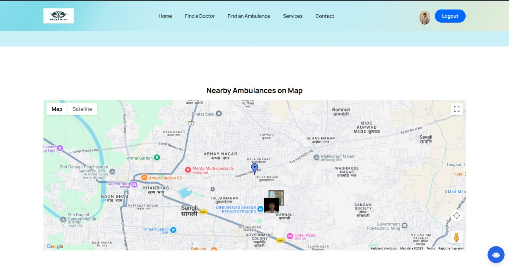
 > View nearby ambulances on an interactive Google Map, similar to food delivery apps.

---

### 1️⃣1️⃣ Booking Ambulance

 > Book an ambulance when the driver is available. Free slots are shown for each driver.

---

### 1️⃣2️⃣ Ambulance Driver Home & Status Toggle
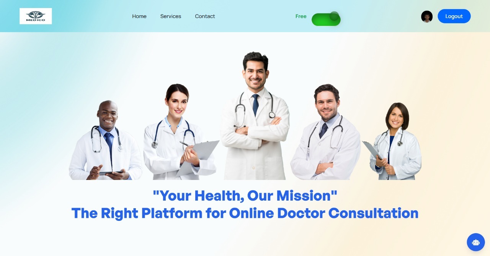
 > Ambulance drivers have a dedicated home page with a toggle button to set their status as 'Free' or 'Engaged' during service.

---

### 1️⃣3️⃣ Ambulance Appointments Tracking
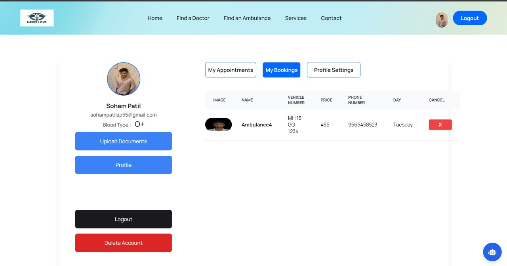
 > Track all booked ambulance services and their statuses.

---

### 1️⃣4️⃣ Ambulance Driver Profile
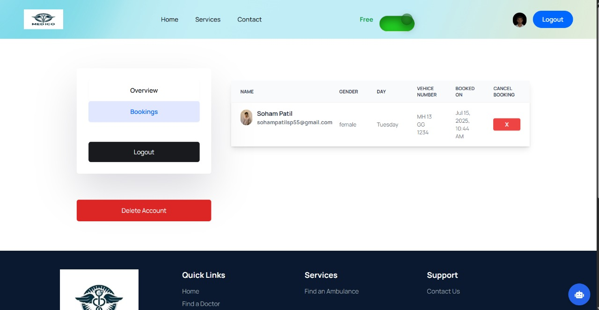
 > Ambulance drivers can view and manage their service history from their profile page.

---

### 1️⃣5️⃣ Documents Vault
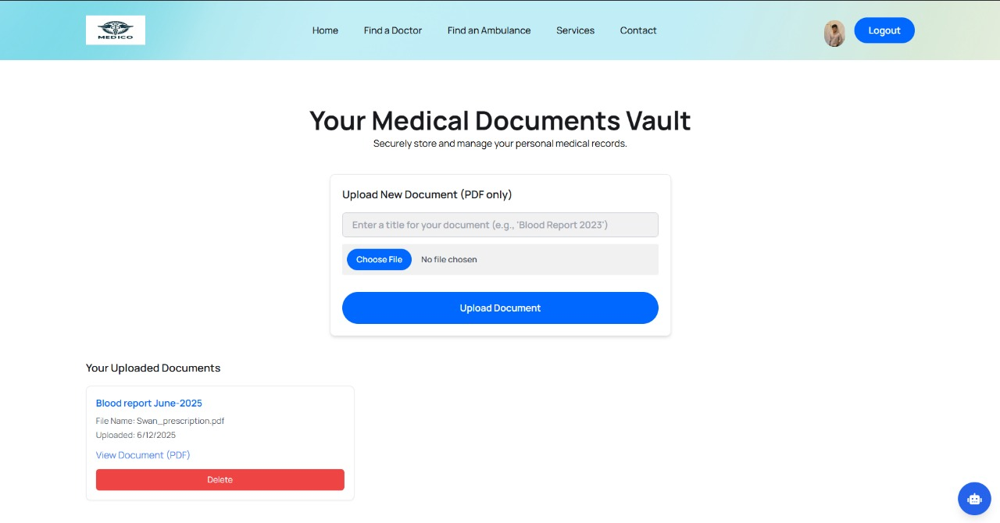
 > Securely store and manage medical reports and documents in the digital vault.

---

### 1️⃣6️⃣ Prescription Creation & Sending
<table><tr>
<td>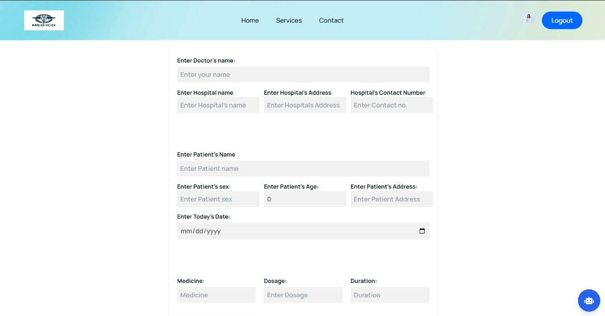</td>
<td></td>
</tr><tr>
<td colspan="2" align="center">
>Templates for creating prescriptions with tabular medicine/dose entry, and direct sending to patients via WhatsApp.
</td></tr></table>

---

## 🔮 Future Scope

- 🩺 **AI-based Symptom Checker & Triage**
- 📱 **Dedicated Mobile App**
- 🌐 **Multi-language Support**
- 🏥 **Integration with Local Pharmacies for Medicine Delivery**
- 📊 **Health Analytics Dashboard for Users**

---

📌 *Open for collaborations or feedback — connect via [GitHub](https://github.com/Somzee5) or [LinkedIn](https://www.linkedin.com/in/soham-patil-344aa1264/)!* 